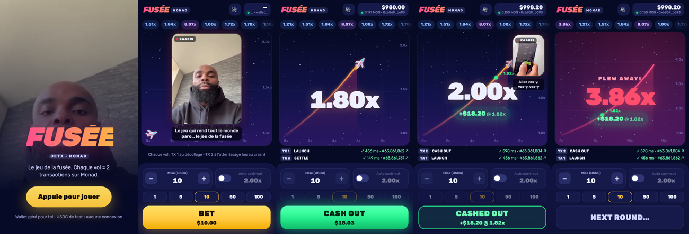

# JetX · Monad

A mobile rocket crash game on Monad Testnet, with Kaaris live on the mic. Tap to bet, watch the rocket climb, cash out before it blows up.

**Play: https://jetx-monad.vercel.app** (on your phone; on desktop it opens in a phone frame)

Built at **Monad Blitz Paris** (19 September 2026).



## How it plays

- **No wallet to connect.** The first visit creates a wallet in the browser; the house tops it up with gas (MON) and 1,000 test USDC.
- **Two transactions per rocket.** `launch(bet)` when you tap BET (the bet is burned and the crash point drawn), then `cashOut(id, multiplier)` when you tap CASH OUT, or `settle(id)` once the rocket has blown up. Every flight is on-chain and linked to the explorer.
- **Bet what you have.** From $0.10 up to the whole balance (MAX chip): there is no house maximum, so a lucky run can go all-in on its winnings.
- **Instant on Monad.** Transactions are signed in the browser with a pre-warmed nonce, fees and gas limit, and sent with `eth_sendRawTransactionSync`: one round trip returns the receipt, in about half a second.
- **Kaaris reacts live, with the French meme crew.** A facecam bubble keeps a meme on screen for the whole flight, popping right, then left, then right. Each moment of the flight has its own pool, dealt like a shuffled deck saved on the device: every meme of a pool plays before one comes back, none plays twice in the same flight, and the next game carries on the decks instead of replaying the same lines at the same spots:
  - **start:** Kaaris only, "allez, je vais jouer 10 balles… c'est parti";
  - **climb:** Kaaris egging it on, Morsay's "ça c'est ma fusée", "oh là là", "énorme", Jacquouille's "Okayyy", JCVD's "je suis aware", "c'est une dinguerie", "magnifique";
  - **orbit (random slot between 2.2x and 3.5x, every flight that gets there):** Thomas Pesquet, big and centred;
  - **high up:** "ça va péter", "on va tous mourir", Les Visiteurs, "avant qu'il explose", Foucault's "c'est votre dernier mot ?";
  - **cash out:** Eléonore or "rigolo" under 1.2x (ironic), "je m'arrête à 6", "bim bam boom", "validé", SCH, "je suis riche" or "je peux mourir tranquille" past 10x;
  - **after you cashed out:** "c'est grave la haine" as it keeps climbing, Jean Lassalle's "c'est pas fini ?" when it goes far;
  - **crash (a crash line, often a second one, then an invitation to relaunch):** Nils's "super pour l'appareil photo" (the favourite), Brogniart's "Ah !" and "la sentence est irrévocable", "vous êtes le maillon faible, au revoir", "Houston, on a un problème", "monde de merde", Jean-Pierre Coffe, Etchebest, Giscard's "au revoir", "pas de bras, pas de chocolat", "qu'est-ce que c'est que ce binz", putain / Macron / "boulette" / "coup dur", Taxi 2's "catastrophe"; then "sur un malentendu, ça peut marcher" or "premier crash remboursé";
  - **idle / broke:** "laisse voler ton avion", Kaamelott, Otis's "bonne ou mauvaise situation", "c'est cela, oui", "swipe up", "c'est la hess".

## Game math

Multipliers are x100 fixed point on-chain. The crash point starts from the classic crash-game draw and is made much more generous for the testnet event. The live game runs `setCurve(9900, 25000)`:

```
base:   P(base ≥ x) = 0.99 / x           (1% instant busts at 1.00x)
crash:  crash = 1 + (base − 1) × 2.5     (every flight above 1x stretched 2.5x)
        → P(crash ≥ x) = 0.99 / (1 + (x − 1) / 2.5), capped at 50x
```

That gives a median crash around 3.45x, 71% of flights past 2x, 38% past 5x, 22% past 10x and ~5% reaching the 50x cap (contract defaults at deploy: 0.985 and 1.5x, median ~2.45x). The house can retune both knobs (`setCurve`) and the cap (`setMaxMultiplier`) on-chain within fixed bounds. The rocket's multiplier grows slowly, as `m(t) = e^(0.06·t)` (2x after ~11.5 s, 5x after ~27 s, 10x after ~38 s). A cash-out can never exceed the flight's crash point. Launching again forfeits an unfinished flight, and anyone can close a flight abandoned for an hour.

## Contracts

| Contract | Role |
| --- | --- |
| `JetX` | The game: `launch`, `cashOut`, `settle`, recent crash history, stats, faucet, house `grant`. |
| `JetUSD` | 6-decimal test USDC. Only the game mints (payouts, faucet) and burns (bets), so playing never needs an approval. |
| `GasSponsor` | Sends the same MON top-up to many players in one transaction, so a burst of arrivals costs the house one nonce, not one per player. |

Randomness comes from block data at launch. That is fine for a testnet game with test dollars, but the crash point is readable once the launch is mined; a real-money version would draw it from a VRF or a commit-reveal house seed.

## Deployment (Monad Testnet, chain 10143)

| Contract | Address |
| --- | --- |
| JetX | [`0x562f2a45882136439fb301f8c431BA506032cEBE`](https://testnet.monadexplorer.com/address/0x562f2a45882136439fb301f8c431BA506032cEBE) |
| JetUSD (test USDC) | [`0xf9b4ba2415cE621422109d1833C8A620b5aA9cF8`](https://testnet.monadexplorer.com/address/0xf9b4ba2415cE621422109d1833C8A620b5aA9cF8) |
| GasSponsor | [`0xab217220314aE766AF5266c8C55BA643758dBEfA`](https://testnet.monadexplorer.com/address/0xab217220314aE766AF5266c8C55BA643758dBEfA) |

Measured on testnet: `launch` 160k gas (0.016 MON), `cashOut` 105k (0.011 MON), `settle` 84k (0.009 MON). Sign-to-receipt median **~480 ms**.

## What we learned about Monad

- **`eth_sendRawTransactionSync` works** and returns the receipt in one round trip. Combined with a locally tracked nonce, cached fees and pre-estimated gas (estimated while the rocket flies), a tap becomes a confirmed transaction in about half a second.
- **Monad bills the gas limit, not the gas used.** Every receipt shows `gasUsed == gasLimit`, so the gas headroom is kept at 10%.
- **Reserve balance and delayed state.** Consensus checks balances against state 3 blocks behind the tip, so a wallet funded a moment ago is rejected with `Signer had insufficient balance`. Nodes also cache that rejection for the identical raw transaction, so naive retries fail forever. The app waits 4 blocks after a top-up and re-signs each retry with a 1-wei higher tip.

## Tests

- `contracts/`: 13 Foundry tests, including an empirical check of the crash distribution and the 50x cap over 4,000 draws.
- `e2e/`: 14 deterministic tests in mock mode (one per reaction rule, variety across flights, the always-on meme rhythm and the flight animations), and 7 Playwright tests in an iPhone viewport against the live game on Monad Testnet: landing (intro clip + managed wallet funding), auto cash-out win, loss and settle, manual cash-out paid at the tapped multiplier, the Thomas Pesquet clip past 5x, reload keeping the wallet, and going broke then refilling. Every step is checked on-chain.

```bash
cd e2e && pnpm install
BASE_URL=https://jetx-monad.vercel.app npx playwright test
```

## Repo layout

```
contracts/   Foundry: src/JetX.sol, src/JetUSD.sol, tests (incl. distribution check), deploy script
app/         Next.js mobile game: rocket canvas, bet panel, Kaaris clip engine, managed wallet, /api/fund
app/public/kaaris/   65 reaction clips + clips.json (caption, trigger, speaker)
e2e/         Playwright tests against the live game (phone viewport, on-chain assertions)
docs/        Screenshots
```

## Run it

```bash
cd contracts && forge test
source .env && forge script script/Deploy.s.sol --rpc-url $RPC_URL --broadcast   # writes deployments/10143.json
cp deployments/10143.json ../app/lib/deployments/

cd ../app && pnpm install
HOUSE_PRIVATE_KEY=0x… pnpm dev             # the house key funds new players
NEXT_PUBLIC_CHAIN_MODE=mock pnpm dev      # UI only, no chain
```
